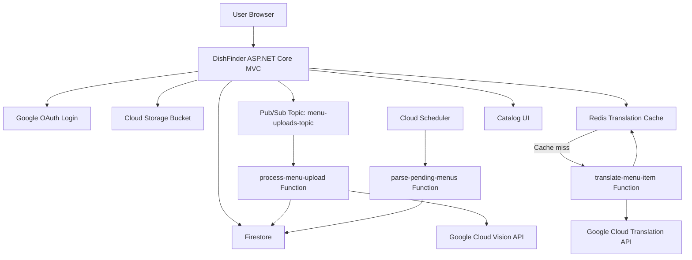

# Cloud Dish Finder Platform

Cloud Dish Finder, also referred to as **DishFinder** or **MenuVision**, is a cloud-based restaurant menu processing system.

The application allows authenticated users to create restaurant records, upload menu images, process those images with OCR, store structured menu items in Firestore, search and sort confirmed dishes, translate menu text, and cache translation results with Redis.

---

## Table of Contents

- [Project Overview](#project-overview)
- [Key Features](#key-features)
- [Architecture Overview](#architecture-overview)
- [Technology Stack](#technology-stack)
- [Repository Structure](#repository-structure)
- [Cloud Resources](#cloud-resources)
- [Firestore Data Model](#firestore-data-model)
- [Main Application Flow](#main-application-flow)
- [Local Development Setup](#local-development-setup)
- [Configuration](#configuration)
- [Docker and Cloud Run Deployment](#docker-and-cloud-run-deployment)
- [Cloud Run Functions](#cloud-run-functions)
- [Testing Checklist](#testing-checklist)
- [Known Limitations](#known-limitations)
- [Troubleshooting Notes](#troubleshooting-notes)

---

## Project Overview

Cloud Dish Finder is an **ASP.NET Core MVC** application hosted on **Google Cloud Run**. It uses Google Cloud services to process menu images asynchronously.

The main workflow is:

```text
Google Login
→ Create Restaurant
→ Upload Menu Images
→ Store Images in Cloud Storage
→ Store Metadata in Firestore
→ Publish Pub/Sub Message
→ Run OCR Processing Function
→ Parse Pending Menus
→ Search Confirmed Catalog Items
→ Translate Menu Text
→ Cache Translations in Redis
```

The project demonstrates a distributed cloud architecture using web application hosting, object storage, NoSQL database design, event-driven processing, scheduled background processing, external API integration, secret management, Redis caching, and container deployment.

---

## Key Features

- Google OAuth login.
- Protected upload, restaurant creation, and catalog pages.
- Restaurant creation form.
- Multi-image menu upload.
- Drag-and-drop upload UI.
- Per-file upload progress indicator.
- Cloud Storage upload for menu images.
- Firestore hierarchical NoSQL database.
- Pub/Sub message publishing after image upload.
- OCR processing with Google Cloud Vision API.
- Scheduled pending-menu parsing.
- Searchable catalog of confirmed menu items.
- Price sorting: lowest first and highest first.
- Translation using Google Cloud Translation API.
- Redis-backed translation cache.
- Cache invalidation when restaurant/menu data changes.
- Dockerized ASP.NET Core MVC deployment to Cloud Run.

---

## Architecture Overview



The main MVC application handles user interaction. Background services handle OCR, parsing, and translation so that expensive processing is separated from the upload request.

---

## Technology Stack

### Application

| Area             | Technology                           |
| ---------------- | ------------------------------------ |
| Web framework    | ASP.NET Core MVC                     |
| Runtime          | .NET 8                               |
| Language         | C#                                   |
| Views            | Razor Views                          |
| Frontend         | HTML, CSS, Bootstrap, JavaScript     |
| Authentication   | Google OAuth + Cookie Authentication |
| Containerisation | Docker                               |

### Google Cloud

| Area               | Service               |
| ------------------ | --------------------- |
| Hosting            | Cloud Run             |
| Object storage     | Cloud Storage         |
| Database           | Firestore             |
| Messaging          | Pub/Sub               |
| OCR                | Cloud Vision API      |
| Translation        | Cloud Translation API |
| Scheduling         | Cloud Scheduler       |
| Secrets            | Secret Manager        |
| Logging            | Cloud Logging         |
| Container registry | Artifact Registry     |

### Caching

| Area        | Technology          |
| ----------- | ------------------- |
| Cache       | Redis               |
| .NET client | StackExchange.Redis |

---

## Repository Structure

```text
cloud-dish-finder-platform/
│
├── CloudDishFinder.slnx
│
├── DishFinder/
│   ├── Controllers/
│   │   ├── AccountController.cs
│   │   ├── CatalogController.cs
│   │   ├── HomeController.cs
│   │   ├── RestaurantsController.cs
│   │   └── UploadController.cs
│   │
│   ├── DataAccess/
│   │   └── FirestoreMenuRepository.cs
│   │
│   ├── Interfaces/
│   │   ├── IBucketStorageService.cs
│   │   ├── IFirestoreMenuRepository.cs
│   │   ├── IMenuTranslationService.cs
│   │   ├── IPubSubPublisherService.cs
│   │   └── ITranslationCacheService.cs
│   │
│   ├── Models/
│   ├── Services/
│   ├── Views/
│   ├── wwwroot/
│   ├── Program.cs
│   ├── appsettings.json
│   ├── Dockerfile
│   └── DishFinder.csproj
│
├── cloud-run-functions/
│   ├── process-menu-upload/
│   ├── parse-pending-menus/
│   └── translate-menu-item/
│
├── .dockerignore
├── .gitignore
└── README.md
```

The solution file includes the main `DishFinder` MVC project. The Cloud Run function source code is stored in `cloud-run-functions/` so that the background services can be reviewed with the rest of the project.

---

## Cloud Resources

| Resource                     | Value                   |
| ---------------------------- | ----------------------- |
| Pub/Sub topic                | `menu-uploads-topic`  |
| OCR service/function         | `process-menu-upload` |
| Parser service/function      | `parse-pending-menus` |
| Translation service/function | `translate-menu-item` |

### Deployed Application

```text
https://dishfinder-web-240870875860.europe-west10.run.app
```

---

## Firestore Data Model

Firestore is used as the main NoSQL database.

```text
restaurants/{restaurantId}
├── name
├── address
├── status
├── createdAt
└── updatedAt

restaurants/{restaurantId}/menus/{menuId}
├── menuTitle
├── status
├── latestUploadAt
├── createdAt
├── updatedAt
├── lastProcessedAt
├── ocrTextRaw
├── ocrText
├── ocrSearchText
├── parsedAt
└── parsedItems[]

restaurants/{restaurantId}/menus/{menuId}/images/{imageId}
├── fileName
├── bucketName
├── objectName
├── contentType
├── uploadedBy
├── uploadedAt
├── gsUri
├── ocrTextRaw
├── ocrText
├── ocrSearchText
├── processedAt
└── updatedAt
```

### Parsed Menu Item Shape

```json
{
  "name": "Bruschetta Trio",
  "description": "Tomato, basil, garlic and olive oil",
  "priceText": "€8.50",
  "priceValue": 8.5,
  "section": "STARTERS",
  "normalizedName": "bruschetta trio"
}
```

---

## Main Application Flow

### 1. Authentication

1. User clicks **Login with Google**.
2. The app redirects to Google OAuth.
3. On successful login, the app stores claims such as email and profile picture.
4. Protected pages become available.

Protected controllers:

```text
UploadController
RestaurantsController
CatalogController
```

### 2. Restaurant Creation

1. Authenticated user opens `/Restaurants/Create`.
2. User enters restaurant name and address.
3. The controller builds a restaurant ID from the name and address.
4. Firestore restaurant document is created or updated.

### 3. Menu Upload

1. User opens `/Upload/Create`.
2. User selects a restaurant and enters a menu title.
3. User selects or drags one or more menu images.
4. JavaScript starts the upload process.
5. MVC creates a menu document in Firestore.
6. Each image is uploaded to Cloud Storage.
7. Firestore image reference is created.
8. Pub/Sub message is published.

Cloud Storage object path pattern:

```text
restaurants/{restaurantId}/menus/{menuId}/{guid}-{originalFileName}
```

### 4. OCR Processing

1. Pub/Sub triggers `process-menu-upload`.
2. The function reads the uploaded image URI.
3. Cloud Vision API extracts OCR text.
4. OCR text is cleaned.
5. Image-level OCR fields are saved to Firestore.
6. Combined menu-level OCR fields are saved to the menu document.
7. Menu remains `pending` until parsed.

### 5. Scheduled Parsing

1. Cloud Scheduler triggers `parse-pending-menus`.
2. The parser searches pending menu documents.
3. It reads `ocrTextRaw` or falls back to `ocrText`.
4. Regex parser extracts sections, item names, descriptions, and prices.
5. Parsed items are stored in Firestore.
6. Menu status becomes `confirmed` when parsed items exist.
7. Restaurant status becomes `confirmed` when no pending menus remain.

### 6. Catalog Search and Translation

1. User opens `/Catalog/Index`.
2. Confirmed menu items are loaded from Firestore.
3. User can search by item, description, section, restaurant, or menu title.
4. User can sort by price ascending or descending.
5. User clicks **Translate**.
6. MVC checks Redis cache.
7. If cache hit: cached translation is returned.
8. If cache miss: `translate-menu-item` is called.
9. Translation result is stored in Redis and displayed in the catalog.
10. User can click **Reset** to restore original text.

---

## Local Development Setup

### Prerequisites

Install:

- [.NET 8 SDK](https://dotnet.microsoft.com/download/dotnet/8.0)
- Docker Desktop
- Google Cloud CLI
- Visual Studio 2022
- Google Cloud project with required services enabled
- Redis instance, such as Redis Cloud

Required Google Cloud APIs:

```text
Cloud Run
Cloud Storage
Firestore
Pub/Sub
Cloud Vision API
Cloud Translation API
Secret Manager
Cloud Scheduler
Artifact Registry
Cloud Logging
```

### Clone Repository

```powershell
git clone https://github.com/ZamirLucky/cloud-dish-finder-platform.git
cd cloud-dish-finder-platform
git switch 09-add-cloud-run-functions
```

### Restore and Build

```powershell
dotnet restore
dotnet build
```

Or open:

```text
CloudDishFinder.slnx
```

Then set `DishFinder` as the startup project.

---

## Configuration

The project uses `appsettings.json`, environment variables, User Secrets, and Secret Manager.

### Safe Configuration Template

Use environment variables on Cloud or User Secrets for local development:

```powershell
dotnet user-secrets set "GoogleCloud:ProjectId" "your-project-id" --project DishFinder
dotnet user-secrets set "GoogleCloud:StorageBucketName" "your-bucket-name" --project DishFinder
dotnet user-secrets set "GoogleCloud:PubSubTopicId" "your-topic-name" --project DishFinder

dotnet user-secrets set "Secrets:GoogleOAuthClientIdSecretName" "google-oauth-client-id" --project DishFinder
dotnet user-secrets set "Secrets:GoogleOAuthClientSecretSecretName" "google-oauth-client-secret" --project DishFinder

dotnet user-secrets set "Redis:Host" "your-redis-host" --project DishFinder
dotnet user-secrets set "Redis:Port" "10503" --project DishFinder
dotnet user-secrets set "Redis:User" "default" --project DishFinder
dotnet user-secrets set "Redis:Password" "your-redis-password" --project DishFinder

dotnet user-secrets set "CloudFunctions:TranslateMenuItemUrl" "https://translate-menu-item-xxxx.run.app" --project DishFinder
dotnet user-secrets set "CloudFunctions:TranslateMenuItemRequireAuth" "true" --project DishFinder
```

---

## Docker and Cloud Run Deployment

### Build Docker Image Locally

```powershell
docker build -f DishFinder/Dockerfile -t dishfinder-web:local .
```

### Run Docker Locally with Google ADC

```powershell
docker run --rm -p 8080:8080 `
  -e GOOGLE_APPLICATION_CREDENTIALS="/app/secrets/application_default_credentials.json" `
  -v "$env:APPDATA\gcloud\application_default_credentials.json:/app/secrets/application_default_credentials.json:ro" `
  dishfinder-web:local
```

This local Docker command is for development only. In production, Cloud Run uses the service account attached to the service.

### Deployment Variables

```powershell
$PROJECT_ID="your_cloud_project_id"
$REGION="your_Cloud_selected_region"
$REPO="Your_Cloud_repo"
$SERVICE="your_cloud_service_web"
$IMAGE="${REGION}-docker.pkg.dev/${PROJECT_ID}/${REPO}/${SERVICE}:v1"
```

### Tag and Push Image

```powershell
docker tag $SERVICE:local $IMAGE
docker push $IMAGE
```

### Deploy MVC App to Cloud Run

Configure secrets through Secret Manager:

```powershell
gcloud run deploy $SERVICE `
  --image $IMAGE `
  --region $REGION `
  --platform managed `
  --allow-unauthenticated `
  --port 8080 `
  --set-env-vars "ASPNETCORE_ENVIRONMENT=Production,GOOGLE_CLOUD_PROJECT=$PROJECT_ID,Redis__Host=YOUR_REDIS_HOST,Redis__Port=10503,Redis__User=default,CloudFunctions__TranslateMenuItemUrl=https://translate-menu-item-xxxx.run.app,CloudFunctions__TranslateMenuItemRequireAuth=true" `
  --set-secrets "Redis__Password=your-redis-password:latest"
```

---

## Cloud Run Functions

The repository includes three function folders.

### `process-menu-upload`

Location:

```text
cloud-run-functions/process-menu-upload/
```

Purpose:

- Triggered by Pub/Sub.
- Reads menu image details.
- Calls Cloud Vision OCR.
- Cleans OCR text.
- Updates Firestore image and menu documents.

Build:

```bash
cd cloud-run-functions/process-menu-upload
dotnet build
```

### `parse-pending-menus`

Location:

```text
cloud-run-functions/parse-pending-menus/
```

Purpose:

- HTTP function.
- Intended for manual testing and Cloud Scheduler.
- Reads pending Firestore menus.
- Parses OCR text into structured menu items.
- Updates menu and restaurant statuses.

Build:

```bash
cd cloud-run-functions/parse-pending-menus
dotnet build
```

Manual test pattern:

```bash
SERVICE_URL="https://parse-pending-menus-xxxx.run.app"

curl -i -X POST "$SERVICE_URL?limit=10" \
  -H "Authorization: Bearer $(gcloud auth print-identity-token)" \
  -H "Content-Type: application/json" \
  -d '{}'
```

### `translate-menu-item`

Location:

```text
cloud-run-functions/translate-menu-item/
```

Purpose:

- HTTP function.
- Accepts text and target language.
- Calls Google Cloud Translation API.
- Returns translated text to the MVC application.

Build:

```bash
cd cloud-run-functions/translate-menu-item
dotnet build
```

Manual test pattern:

```bash
SERVICE_URL="https://translate-menu-item-xxxx.run.app"

curl -i -X POST "$SERVICE_URL" \
  -H "Authorization: Bearer $(gcloud auth print-identity-token)" \
  -H "Content-Type: application/json" \
  -d '{
    "text": "Bruschetta Trio",
    "targetLanguage": "it"
  }'
```

---

## Testing Checklist

Use this sequence to verify the full system:

```text
1. Open deployed Cloud Run web app.
2. Confirm home page loads.
3. Login with Google.
4. Confirm logged-in user appears in the navbar.
5. Create a restaurant.
6. Upload multiple menu image/s.
7. Confirm upload progress is visible.
8. Confirm images appear in Cloud Storage.
9. Confirm Firestore image references are created.
10. Confirm Pub/Sub message is published.
11. Confirm process-menu-upload logs show OCR processing.
12. Confirm Firestore menu document contains OCR text.
13. Trigger or wait for Cloud Scheduler.
14. Confirm parse-pending-menus logs show parsing.
15. Confirm structured menu items and prices are stored in Firestore.
16. Open Catalog page.
17. Search for an item.
18. Sort by lowest price.
19. Sort by highest price.
20. Translate a menu row.
21. Translate the same row/language again to confirm Redis cache hit.
```

---

## Known Limitations

| Limitation                           | Explanation                                                                                                         |
| ------------------------------------ | ------------------------------------------------------------------------------------------------------------------- |
| OCR quality depends on image quality | Poor lighting, skewed photos, or complex menu layouts can reduce OCR accuracy.                                      |
| Parser is regex-based                | It may produce noisy item names or descriptions when OCR output is poor.                                            |
| Translation is row-based             | The catalog translates visible row fields, not full menus in batch.                                                 |
| Catalog filtering is in memory       | Suitable for this project scale, but larger datasets may need denormalized catalog documents or search indexing.    |
| Infrastructure is partly external    | IAM bindings, Scheduler jobs, and Firestore indexes are recorded in notes rather than infrastructure-as-code files. |

---

## Troubleshooting Notes

| Problem                                            | Cause                                                        | Fix                                                                        |
| -------------------------------------------------- | ------------------------------------------------------------ | -------------------------------------------------------------------------- |
| Parser returned HTTP 500                           | Missing Firestore collection-group index                     | Create index for`menus` collection group with `status` filter          |
| Function failed on startup                         | Missing`GOOGLE_CLOUD_PROJECT`                              | Set environment variable in Cloud Run                                      |
| Parser returned zero items                         | OCR/parser assumptions were weak                             | Prefer`ocrTextRaw`, improve regex rules, add parser logging              |
| Firestore decimal converter error                  | Decimal serialization issue                                  | Store price as Firestore-friendly numeric type such as`double`           |
| Local MVC could not call private Cloud Run service | Local ADC could not generate OIDC token                      | Use Cloud Run service account in production and grant`roles/run.invoker` |
| Translation failed with`sourceLanguage = "auto"` | Translation API does not accept`"auto"` as source language | Omit source language when unknown                                          |
|                                                    |                                                              |                                                                            |
|                                                    |                                                              |                                                                            |

---

## Project Status

This project implements the main cloud assignment workflow:

```text
Login
→ Upload
→ Cloud Storage
→ Firestore
→ Pub/Sub
→ OCR
→ Scheduled Parsing
→ Catalog Search/Sort
→ Translation
→ Redis Cache
→ Cloud Run Deployment
```

The implementation is designed around the technologies taught in the Programming for the Cloud 25-26 unit.
